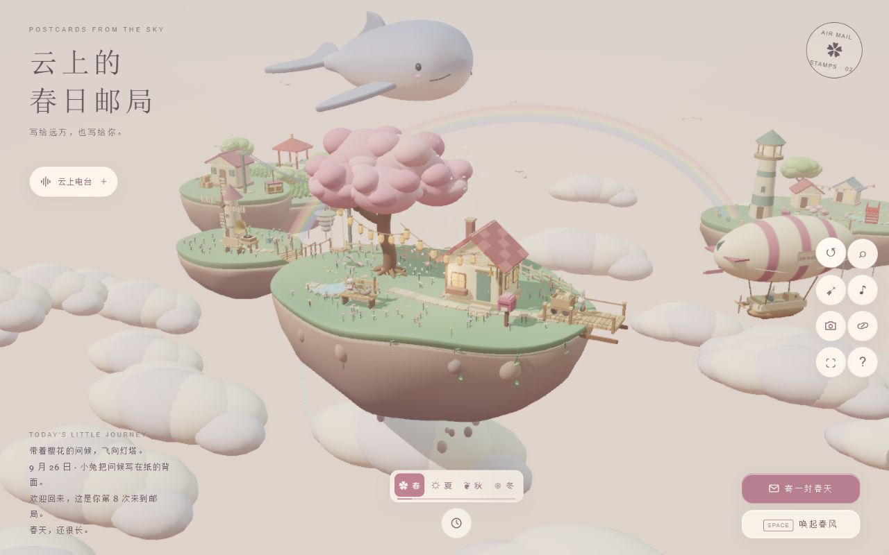

# 圆润童话场景改造

以云鲸为造型基准，将方块场景逐步统一为哑光、柔和的微缩景观。

- 主岛及周边岛使用连续草地与雕塑式岩土轮廓，草地保留四季渐变。
- 樱花树、远岛树冠、云团、动物和花草改成圆润形状；建筑、家具、码头与缆车使用共享圆角几何体。
- 飞艇与热气球使用连续气囊和贴合曲面的条纹；邮局、小屋和驿站使用连续屋顶，灯塔与风车改成圆塔。
- 水池改成连续椭圆水面，留声机增加圆形唱片和喇叭；界面统一奶油色纸面与柔和阴影。
- 保留扩展后的岛屿布局、邮路、季节、行走和互动；茶山视角从侧面避开驿站遮挡。

[手机全景](./mobile.png) · [手机时间卡片展开](./mobile-controls.png)

## 验证

- 单元测试：26 个文件，140 项测试通过。
- 构建（含 TypeScript 检查）与 lint：通过。
- 浏览器 WebGL 验证：三次创建和销毁、模拟暂停、寄信和回信、季节切换、资源回落、不可用提示与上下文恢复均通过，详见 [原始报告](./browser-checks.txt)。
- 该桌面设备单独运行的 10 次稳定帧率采样均为 60 FPS；其他设备表现仍取决于 GPU 和画质设置。
- 检查了桌面全景、主岛近景、花园、灯塔、茶山、温泉村、驿站及缆车、夜间、冬季和 390 像素宽手机布局。手机时间卡片与操作按钮没有重叠或横向溢出。
- 夕照、树下、夜间、冬季的截图基准已更新并逐张检查；本轮没有运行完整 Playwright 套件。

真实手机 GPU 表现未在本轮验证。
