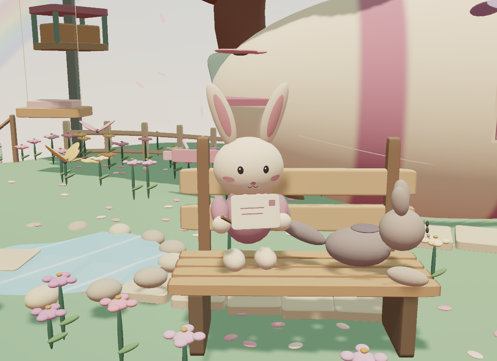
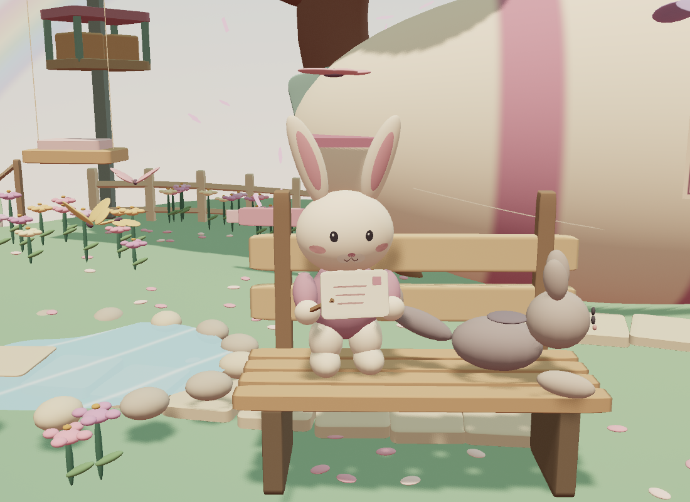
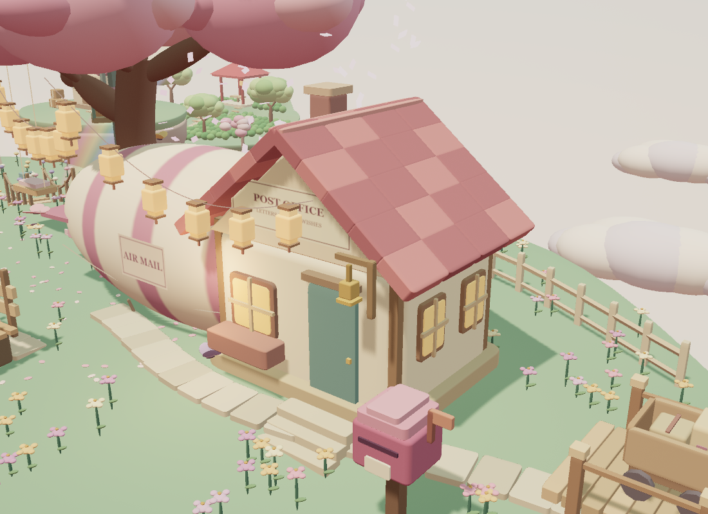
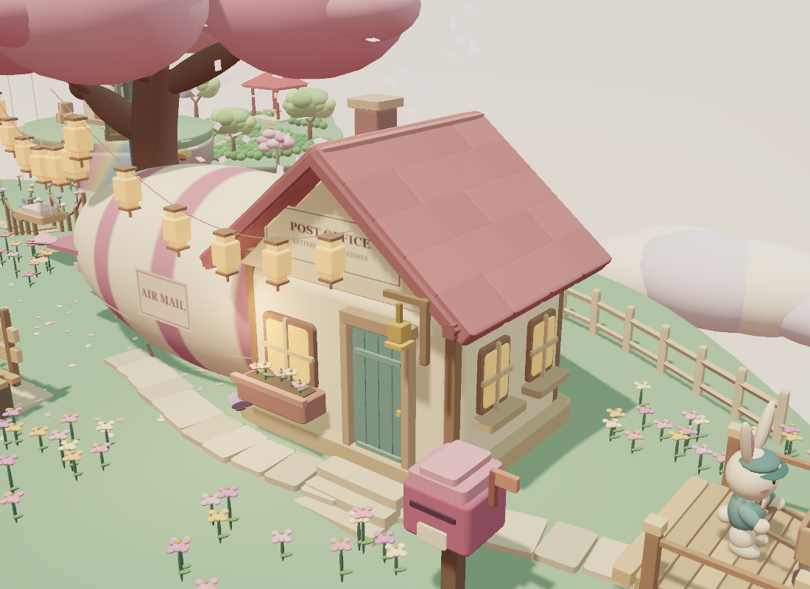
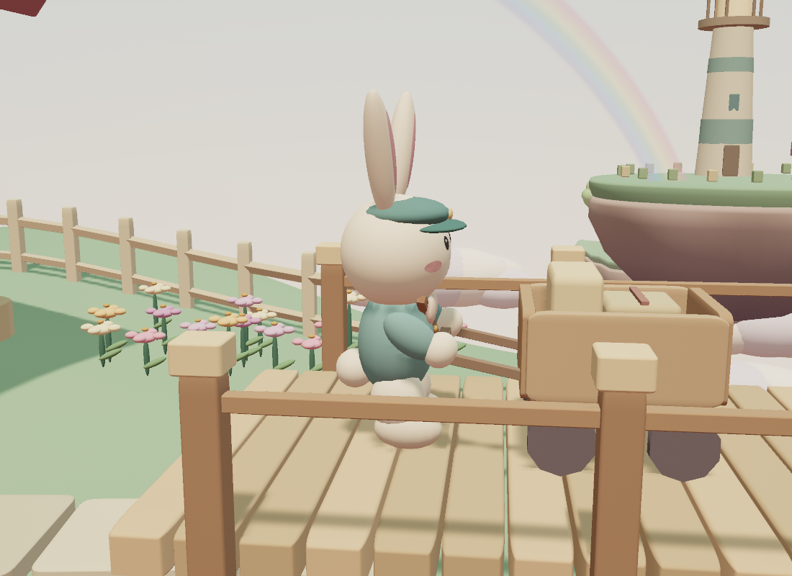
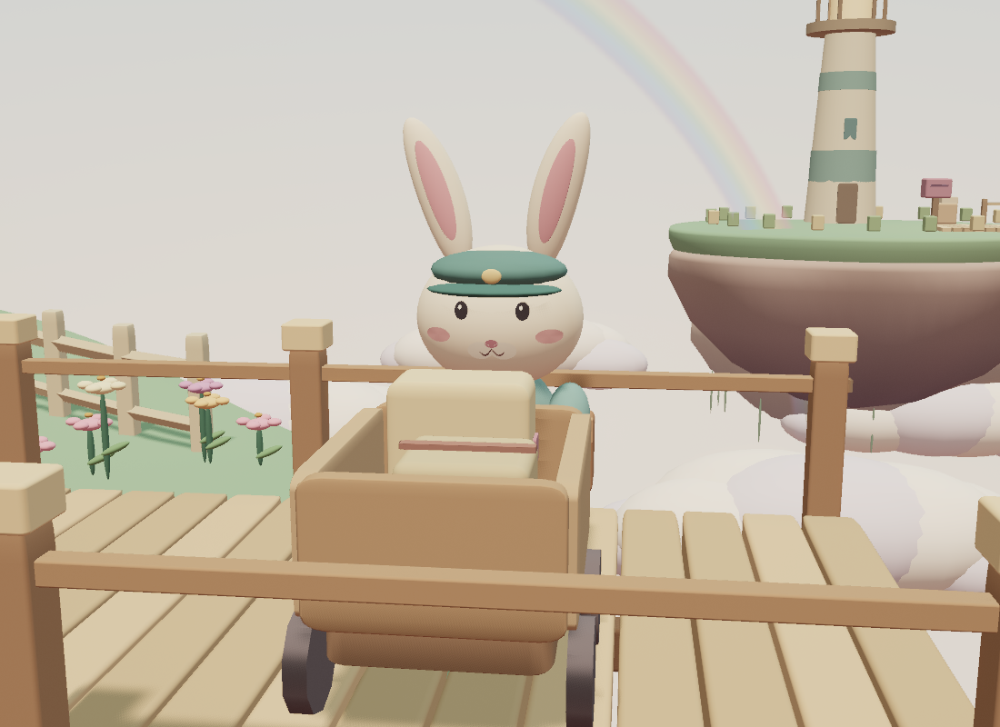
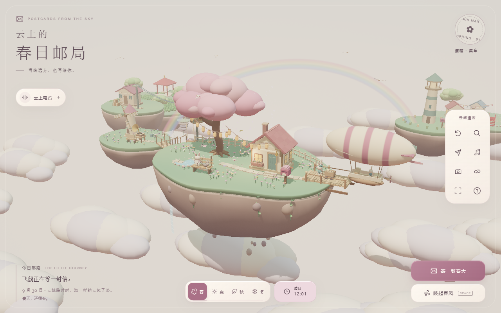
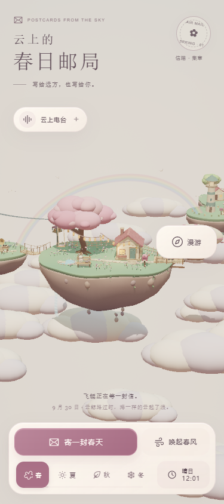

<!-- Hallmark · pre-emit critique: P4 H4 E4 S5 R5 V4 -->

# 春日邮局 · 场景细节美化

验收日期：2026-09-30。保留现有奶油白、樱花粉、鼠尾草绿与圆润陶土风格，不重做页面布局。

## 本轮内容

- **兔子**：接续工作区已有的贴面五官、耳朵、眨眼、邮差服饰和写信动作；补齐身体与脚之间的衔接，避免近景悬空。纸张与三行文字共用倾斜坐标系，文字不再被纸面遮住，笔尖朝向纸面。
- **邮差与推车**：运动采用往返—停步转弯的绝对时间姿态，朝向跟随路线；车轮转动对应行进距离，停步不空转；双手贴合横向把手，缩小推车、校准轮底高度。码头板面宽度由 1.0 调至 1.2，栏杆同步外移，给转弯留出空间。
- **邮局**：瓦片改为邻近粉色、减弱棋盘感；补屋檐收边、门框和门板分缝、侧窗窗台、前窗花箱。花叶沿用四季变化，冬季收起，不增加独立光源。
- **场景**：樱花树花冠由 63 个团块简化为 28 个有主次的团块；花草集中成簇，路径、座椅、树根及池塘与水流区域留空；石板路增加小幅尺寸与角度变化，不修改行走路线。
- **测试**：新增兔子运动单元测试和模型近景浏览器测试；更新旧手机测试，使其先展开现有“漫游”菜单，再操作拍照或指南，未使用强制点击或放宽视觉阈值。

## 画面对比

### 写信兔

修改前：



修改后：



### 邮局

修改前：



修改后：



### 推车与页面









这些是实际运行截图，不是设计稿。近景使用生产模型、材质、日夜系统及输出通道；页面图来自本地生产构建。桌面和手机保留原有 UI。

## 验证结果

- `npm run typecheck`：通过。
- `npm run lint`：通过。
- `npm test`：27 个测试文件，147 项通过。
- `npm run build`：通过。仍有 Three.js 分包约 586 kB 超过 Vite 默认 500 kB 提示线的体积警告；未提高阈值掩盖警告，也未为本次美化改动打包结构。
- `npm run test:visual`：最终源码完整重跑，60 项通过（3.5 分钟）。
- 覆盖兔子正/侧面、邮局正/侧面、四季、冬夜、停步和转弯、重复时间调用、点击反应及 reduced-motion。
- 覆盖 320 / 375 / 414 / 768 px，页面无水平溢出，寄信入口可见且可打开/关闭。
- 原有回归覆盖门铃、信箱与集章、音乐、拍照、漫游、视角分享、离线 PWA、资源释放、WebGL 上下文丢失与恢复。
- 实际生产页在 1280×800、375×844 验证写信窗口，未出现页面异常；本轮近景/桌面交互检查未捕获控制台错误，见 `render-checks.json`。
- WebGL 不可用/上下文恢复测试会故意制造并记录 `Error creating WebGL context`，对应测试通过；这不代表正常页面运行报错。
- 修改文件的格式检查及 `git diff --check`：通过。

视觉基线只在审阅实际截图后更新，维持既有阈值。最初失败包括预期画面差异、未建立的新近景基线、旧手机菜单路径和 JavaScript `-0/+0` 数值比较；均已处理并完整重跑，不保留失败项。

## 渲染成本

同机 Chromium / D3D11，1100×800，`tests/sceneDetails.html`，默认时间 0、正午、春季、高质量；数字包含阴影与输出通道，并非单个对象的面数。

| 固定视角 | 修改前 calls | 修改后 calls | 修改前三角形 | 修改后三角形 |
| -------- | -----------: | -----------: | -----------: | -----------: |
| 写信兔   |          269 |          270 |    1,332,012 |    1,292,020 |
| 邮差正面 |          301 |          301 |    1,341,344 |    1,301,350 |
| 邮局侧面 |          282 |          287 |    1,331,600 |    1,296,056 |

模型细化后，同视角三角形数约下降 3%；draw calls 基本持平或小幅增加。这里只报告实际渲染计数，不将其等同于跨设备 FPS 保证。手掌中心到车把握点距离约 0.0146 世界单位，浏览器测试检查两个转弯过程中均低于 0.04。

## 复现

```sh
npm run typecheck
npm run lint
npm test
npm run build
npm run test:visual
```

单独查看近景：使用 `SCENE_TEST_SERVER=1 npm run dev -- --port 5176`，打开：

- `/tests/sceneDetails.html?shot=writer`
- `/tests/sceneDetails.html?shot=writer-side`
- `/tests/sceneDetails.html?shot=courier-side&time=6`
- `/tests/sceneDetails.html?shot=office&season=3&hour=23`

测试用入口不进入生产构建；视觉基线按平台存储，本轮为 Windows。

## 提交边界

提交本轮源码、相关既有兔子基础改动、测试、视觉基线和本目录精选记录。不包含其他已有未跟踪设计目录、旧截图或 `arrive-mid.png`；完整回归对旧 `docs/screenshots/` 和旧验证日志产生的输出恢复到原版本，避免混入无关历史记录。仅推送功能分支，不合并 `main`。
